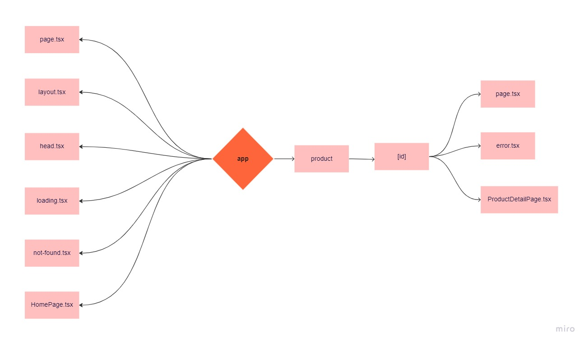
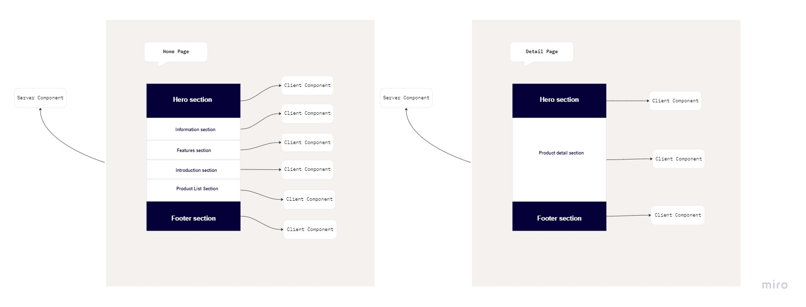

# NEXT.JS VERSION 13.X.X

## AUTHOR

Quyen Huynh

## LIVE DEMO

- [https://nextjs-13-ecommerce.vercel.app/](https://nextjs-13-ecommerce.vercel.app/)

## PERFORMANCE SCORE

- [Mobile](https://pagespeed.web.dev/report?url=https%3A%2F%2Fnextjs-13-ecommerce.vercel.app%2F&form_factor=mobile)
- [Desktop](https://pagespeed.web.dev/report?url=https%3A%2F%2Fnextjs-13-ecommerce.vercel.app%2F&form_factor=desktop)

## DESCRIPTION

- This document provides the requirements for Next.js version 13.x.x.

## TARGETS

- Build web app React latest version (v18+)
- Apply new things from Next.js 13
  - Migrating from /pages to /app
  - New things from Image, Link, Script components
  - Streaming
  - Suspense for Data Fetching
  - Try out with Turbopack-alpha
- Apply TypeScript to type checking
- Apply Chakra UI: https://chakra-ui.com/
- Deploy with Vercel: https://vercel.com/
- Developer tools: Eslint, Prettier, Husky

## REQUIREMENTS

- Implement UI with [Ecommerce Arusa Website Template](https://www.figma.com/file/3b80cSbQyItOS6XaV3ZKwJ/Ecommerce-Arusa-Website?node-id=123%3A2391)
- User can see home page with a list of products
  - User can add new product
  - User can delete product
- User can see details product page
- Navigation to the other page with a new hook

## ENVIRONMENT

- Ubuntu
- Visual Studio Code
- GitLab
- Node v18.10.0

## TECHNOLOGY

- React (v18+)
- Next.js (v13.0.3)
- TypeScript
- [Chakra UI](https://chakra-ui.com/)
- [mockAPI](https://mockapi.io/)

## CONFIGURATIONS

### Create React App with Next.js and TypeScript

#### Option 1: Automatic Installation

- `npx create-next-app@latest --experimental-app`

- or `yarn create next-app --experimental-app`

- or `pnpm create next-app --experimental-app`

#### Option 2: Manual Installation

- To create a new Next.js app, install the required packages:
  - `npm install next@latest react@latest react-dom@latest eslint-config-next@latest`
  - or `yarn add next@latest react@latest react-dom@latest eslint-config-next@latest`
  - or `pnpm update next@latest react@latest react-dom@latest eslint-config-next@latest`
- Open package.json and add the following scripts:

```
"scripts": {
  "dev": "next dev",
  "build": "next build",
  "start": "next start",
  "lint": "next lint"
}
```

- Next, opt-into the beta app directory. Create a next.config.js file and add the following code: next.config.js

```
/** @type {import('next').NextConfig} */
const nextConfig = {
  experimental: {
    appDir: true,
  },
};

module.exports = nextConfig;
```

- Create an app folder and add a layout.js, page.js, and head.js files. These will be rendered when the user visits the root of your application.

#### Setup Chakra UI and Mock Server Worker

- pnpm i @chakra-ui/react @emotion/react @emotion/styled framer-motion
- pnpm i msw --dev

## Inside of the app directory

- Live chart: [inside-app](https://miro.com/app/board/uXjVP-ncnV8=/)

  

## Inside of the page layouts

- Live chart: [page-layouts](https://miro.com/app/board/uXjVP-DoUyQ=/)

  

## RUN PROJECT

| Syntax                                                                  | Description                                                       |
| ----------------------------------------------------------------------- | ----------------------------------------------------------------- |
| git clone `git@gitlab.asoft-python.com:quyen.huynh/nextjs-training.git` | Create a copy of the target repository                            |
| `cd ecommerce`                                                          | Change directory to `ecommerce`                                   |
| `pnpm i`                                                                | Installs dependencies                                             |
| `pnpm dev`                                                              | Starts local dev server at localhost:3000                         |
| `pnpm build `                                                           | Generates an optimized version of your application for production |
| `pnpm start`                                                            | Starts local production server at localhost:3001                  |
